---
# :wave: Hi there, I'm KitKatt or Katt!

Nirmini Founder, Security Researcher, Game + Software Developer, Furry, Photographer, etc.

I'm a HS student who loves to tinker with computers and hardware in general to see what I can do with it and how it works. I also work/study in Information Technology and Cybersecurity while maintaining various side projects and coming up with new side projects as well. I don't know everything there is to know about the field, but I try to. I also am a believer in Open-Source Software and its effects on software development as a whole. Other than that, I'm involved in or do pixel art, graphic design, film production/broadcasting, and various other hobbies. I'm also the Director of Nirmini, an indie technology/software development studio. 
Vibe-coding as a practice isn't the worst thing so long as you take responsibility for mistakes and look it over; otherwise, it's incredibly annoying to filter out.

#### 
- Pronouns: [she/her](https://en.pronouns.page/@_simplykatt) :transgender_flag:

## 📌 Key Notes

- Self-Taught CommonJS(Node.js), ModuleJS, Lua/Luau, and C-family developer
- Certified in Web Development, among other things.
- Started coding around **mid-to-late 2019 to early 2020**.
- Founder/Director of [`Nirmini Development`](https://github.com/Nirmini).

## 🛠️ Projects & 🖋 Pentests
### These are projects of mine or that I'm involved in.
#### 🤖 Nova Discord Bot
- [`Nova`](https://github.com/Nirmini/Nova) - A multi-purpose Discord bot and moderation platform for communities of all sizes.
   - [`NovaCore`](https://github.com/simplyKatt/NovaCore) - The open-source core application layer of Nova that we run the Discord.js instance off of.
   - [`NovaWorks`](https://platform.nirmini.dev/docs/platform/nworks) - Nova's Roblox integration and deprecated internal API.
   - [`NovaAPI`](https://platform.nirmini.dev/docs/api/nova) - Nova's Public and Internal API that users can build with

#### 🎮 Game Development Projects
- [`Nirmini Research Complex`] - A Roblox Science Fiction game developed by Nirmini Development that takes place in 2028.
- [`Starlight Media Center `] - A Roblox event venue and recording studio for Starlight Media, which is part of Nirmini.
- ~~[`Bot Maker's Toolkit`] - An App built on GameMaker & Node.js that allows users to create and manage Discord bots via Discord.js.~~

#### 📚 Hobby Projects
- [`LocalMatter`] - A completely self-hosted Matter device controller that can be run locally or connected to a Google/Apple home
   - [`AntiMatter`] - The web-based dashboard for the application and home management utility
   - [`AntiGravity`] - The C#-based dashboard for the app and the home utility, plus some exclusive features
- [`LIFX-Testing`](https://github.com/simplyKatt/LIFX-LAN-Client-Node) - Testing package I made to better manage lights in a way that works and runs locally, and supports all the core features of the app.
- [Agenda for Canvas](https://github.com/simplyKatt/Agenda-for-Canvas) - A simple extension to add support to sync assignments, quizzes, and more into Google Tasks along with other productivity tools.

#### 🛠️ General Projects
- [`Nirmini.dev`](https://nirmini.dev) - Website for my development group, Nirmini, or more formally, Nirmini Development.
- [`Nirmini API`](https://api.nirmini.dev) - Cloudflare Pages-based API created in TypeScript and JavaScript that handles everything API for Nirmini.
- [`Nirmini Devs Platform`](https://platform.nirmini.dev) - A Cloudflare Page that uses React.js so devs can read documentation, test APIs, and manage accounts.
- [`BetterYTPlaylists`] - A project to create a better YT Playlist widget within WordPress, created in PHP.

#### 🖊️ Pentests (Completed and planned/in-progress)
- Securly - N/A

##### 
> *Please note that I tend to get in and out of projects and such pretty frequently, so this may not be entirely accurate.*

## 📊 Github Stats

---

## Here are some of the things I've worked with over the years:

### Languages

### Tools

### Platforms

## Other Stuff

   
Contact Methods

   - [`Primary Discord`](https://discord.com/users/600464355917692952)
   - [`Primary Email (Preferred)`](mailto:west701497@gmail.com)
   - [`Nirmini Email`](mailto:simplykatt@nirmini.dev)
   - [`Nirmini Support`](mailto:support@nirmini.dev)
   - [`Secondary Email`](mailto:simplykit0@proton.me)

  
Links

  - [`Nirmini Community`](https://discord.gg/9Y7aZejzUH)  
  - [`Nirmini Nova`](https://github.com/Nirmini/NovaBot)  
  - [`GitHub Readme Stats`](https://github.com/stats-organization/github-readme-stats-action)  
  - [`Skill Icons`](https://skillicons.dev)
  - [`Roblox`](https://www.roblox.com/users/798440211)

